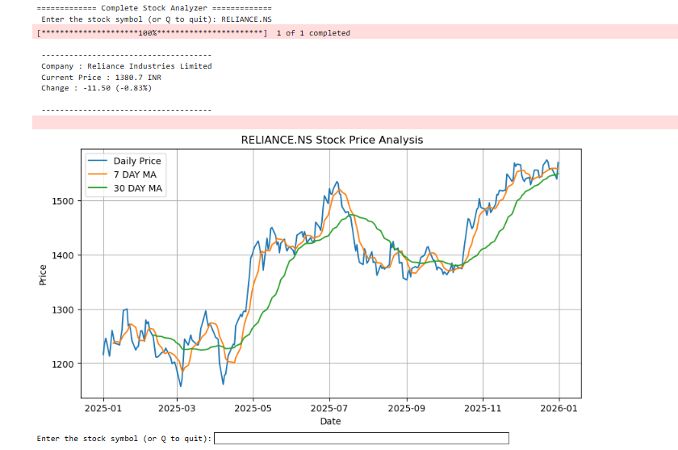
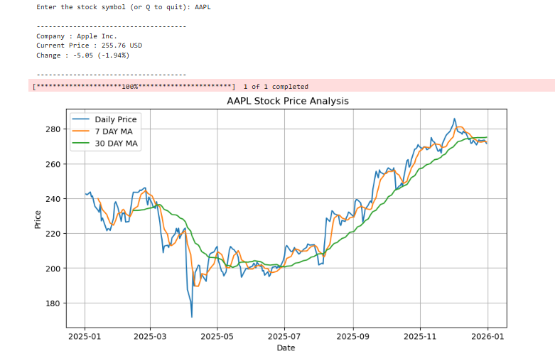

# Stock Market Analyzer 
# Domainc- Finance & Investment Analysis
A Python-based real-time stock market analyzer that fetches live financial data using the Yahoo Finance API and visualizes price trends using moving averages.

## 🎯 Problem Statement

Investors and portfolio managers need to monitor stock performance regularly to make informed investment decisions. Since stock prices change frequently, manually tracking and analyzing these fluctuations can be challenging.

This project provides an automated solution that retrieves real-time stock data and visualizes price trends to help users better understand market behavior.

---

## ⚙️ Project Features

- Fetches live stock market data using the `yfinance` library
- Retrieves company information and current stock price
- Calculates **daily price change and percentage return**
- Performs trend analysis using **moving averages**
- Generates **time-series visualizations of stock performance**

---

## 📈 Technical Analysis Used

### 7-Day Moving Average
- Represents short-term price trends  
- Helps identify recent market momentum  

### 30-Day Moving Average
- Represents long-term price trends  
- Helps smooth out short-term price fluctuations  

By comparing these indicators with daily stock prices, users can better understand **market trends and potential trend reversals**.

---

## 💼 Business Use Cases

### Retail Investor Decision Support
Investors often need to analyze stock performance before investing large amounts of capital. This tool helps investors examine historical trends before making investment decisions.

### Trading Dashboard
The system can function as a simple trading analysis dashboard where users enter a stock symbol and receive a visual analysis of stock performance.

### Risk and Volatility Visualization
Stock prices fluctuate frequently. Visualizing historical price movements helps investors understand market volatility and evaluate potential investment risks.

---

## 🛠 Technologies Used

- Python  
- Pandas  
- NumPy  
- Matplotlib  
- Seaborn  
- yfinance (Yahoo Finance API)

## Sample Output

### Reliance and Apple Stock Analysis

The charts below shows the daily stock price along with 7-day and 30-day moving averages, which help identify short-term and long-term price trends.

